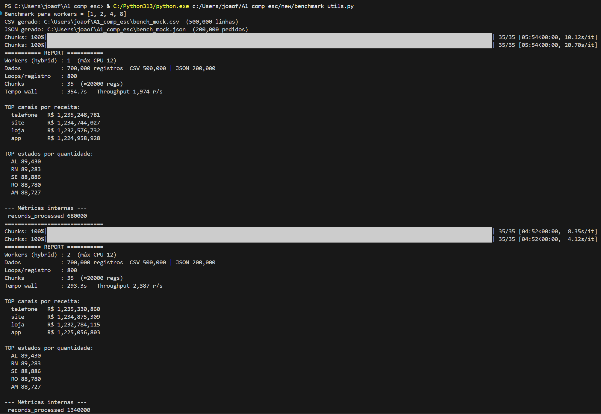
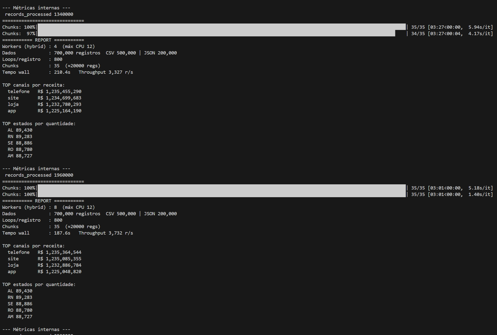
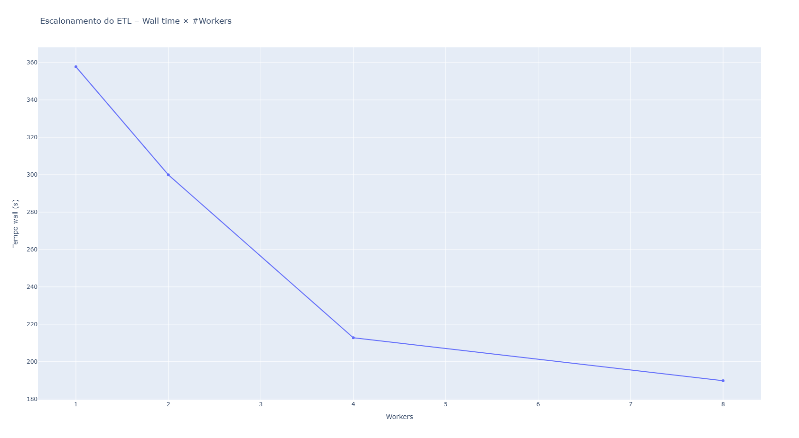

# Repositório para o trabalho de A1 da disciplina de Computação Escalável
## Entrega RPC
O pdf com relatório explicando a lógica da comunicação com RPC implementada está no arquivo Relatorio Trabalho RPC.pdf

Para ligar o servidor com com 5 workers, por exemplo, basta rodar dentro da pasta /gRPC o comando:

`python3 server.py 5`

Para popular o banco de dados e gerar clientes ligados ao servidor enviando mensagens por meio do  padrões de comunicação EnviarPedidosEmLote com 5 clientes, lotes com 20 datapoints e 3 lotes, por exemplo, basta rodar dentro da pasta ./gRPC/ o comando:

`python3 client.py --n_clients 5 --size_batch 20 --n_msgs 3`

Para rodar o pipeline, depois de popular o banco de dados, basta rodar o comando:

`python3 -m new.source.etl.ETL_new`

## Entrega A1: pipeline ETL de Plataforma de E-commerce e Gestão de Cadeia de Suprimentos
O projeto escolhido para mostrar aplicações do nosso micro-framework foi uma Plataforma de E-commerce e Gestão de Cadeia de Suprimentos.

**FAVOR CONSIDERAR CÓDIGO NO INTERIOR DA PASTA NEW**

### Código e como rodar
Utilizamos o uv como gerenciador de pacotes, isso facilita a fim de evitar conflito de dependências (não é o caso), e facilita na hora de rodar o código.
Ao clonar execute no terminal os seguintes comandos:

Windows:
`powershell -ExecutionPolicy ByPass -c "irm https://astral.sh/uv/install.ps1 | iex"`

Linux ou Mac:
```curl -LsSf https://astral.sh/uv/install.sh | sh```

Em seguida, no terminal execute:

`uv init`

`uv run`

Isso instalará todas as dependências necessárias, para mais informações: [https://github.com/astral-sh/uv?tab=readme-ov-file]

Verifique mais detalhes sobre o nosso projeto no [relatório final.](relatorio_final.pdf)

## Primeira entrega (MVP)
A primeira entrega consiste na tentativa de implementação do seguinte MVP do pipeline: 


### Código e como rodar
Primeiramente, baixo o pacote <tqdm> utilizando o instalador de pacote de sua preferência
Exemplo (com pip):

```bash
pip install tqdm
```

Todo o resto do código pode ser executado sem a necessidade de instalação de qualquer outro pacote.

Obs: dependendo da quantidade de dados submetida ao pipeline, há um bug em que um número muito baixo de workers (1 ou 2) pode travar a execução do pipeline, provavelmente por conta de um deadlock que ainda não conseguimos identificar.

---

- A implementação do dataframe do nosso framework está no arquivo <dataframe.py>
- A implementação dos extratores para o MVP está no arquivo <pedidos_handler.py>
- A classe que permite a utilização do pipeline está implementada no arquivo <concurrent_pipeline.py>, onde há também um pequeno exemplo de como utilizar os métodos da classe.
- A execução do MVP de pipeline proposto na imagem é feita no arquivo <mvp_pipeline.py>
  - Nesse arquivo é possível alterar as configurações de geração de dados e configurações do pipeline, em especial dos números de workers em cada teste.
  - a linha 68 contém a lista <num_workers> com os diferentes números de workers para testar a performance do pipeline
  - a linha 70 gera o csv que é o mock do banco de dados com histórico de pedidos
  - a linha 71 gera o mock de pedidos novos no formato de um json
  - as linhas 76 e 79 rodam os extratores desses mocks criados
  - a partir da linha 82 são feitos os testes com o pipeline com os números de workers definidos na lista <num_workers>

 ---

 ## How to use

 ### 1. `mvp_pipeline.py`

#### Visão Geral

- Roda um pipeline ETL sobre dois datasets sintéticos (CSV + JSON).  
- Processa em paralelo usando um pool híbrido (`HybridPool`) de processos e threads, respeitando um limite de CPUs.  
- Gera três agregações simultâneas no worker:
  1. `(produto, centro) → (valor_total, quantidade)`  
  2. `canal_venda → valor_total`  
  3. `estado_cliente → quantidade`  
- Persiste resultados em SQLite e imprime um relatório com:
  - **Throughput** (registros/s)
  - **TOP 5** canais por receita
  - **TOP 5** estados por quantidade
  - Métricas internas (counters)
 
Run no diretório raiz:
`python -m new.source.framework.mvp_pipeline --csv-size 500000 --json-size 200000 --workers 4 --loops 300 --chunksize 50000 --regenerate`

csv_size / json_size
Define o volume de dados sintéticos a gerar (grau de I/O + CPU no parse).

workers
Quanto maior, mais paralelismo — até CPU_LIMIT processos; além disso, threads.

loops
Simula carga de CPU adicional: cada registro sofre N iterações de SHA‑256.

chunksize
Impacta granularidade do paralelismo: chunks pequenos → mais tarefas, overhead maior; chunks grandes → potencial desequilíbrio.

regenerate
Se True, força recriação dos arquivos CSV/JSON mesmo que já existam.

### 2. `benchmark_utils.py`
Run:
`python -m new.source.utils.benchmark_utils.py "1,2,4,8,12"`

### 3. `dashboard.py`
Run:
`python -m streamlit run dashboard.py`
---
## Resultados

<





  
