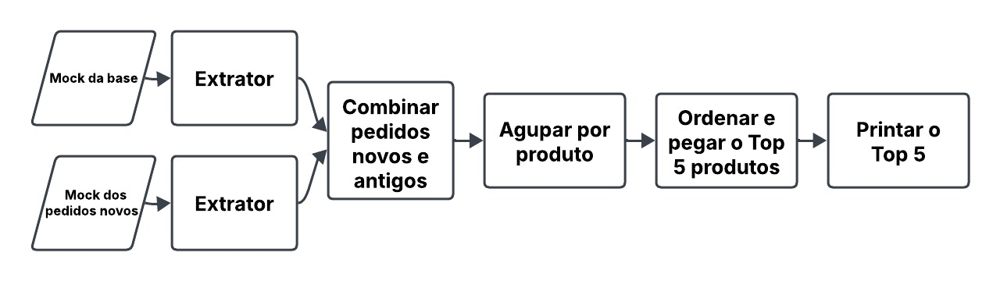

# Repositório para o trabalho de A1 da disciplina de Computação Escalável

## Entrega final: pipeline ETL de Plataforma de E-commerce e Gestão de Cadeia de Suprimentos
O projeto escolhido para mostrar aplicações do nosso micro-framework foi uma Plataforma de E-commerce e Gestão de Cadeia de Suprimentos.
O pipeline de exemplo criado foi o seguinte:


### Código e como rodar
Primeiramente, baixo o pacote <tqdm> utilizando o instalador de pacote de sua preferência
Exemplo (com pip):

```bash
pip install tqdm
```

Verifique mais detalhes sobre o nosso projeto no [relatório final](relatorio_final.docx)

## Primeira entrega (MVP)
A primeira entrega consiste na tentativa de implementação do seguinte MVP do pipeline: 



### Código e como rodar
Primeiramente, baixo o pacote <tqdm> utilizando o instalador de pacote de sua preferência
Exemplo (com pip):

```bash
pip install tqdm
```

Todo o resto do código pode ser executado sem a necessidade de instalação de qualquer outro pacote.

Obs: dependendo da quantidade de dados submetida ao pipeline, há um bug em que um número muito baixo de workers (1 ou 2) pode travar a execução do pipeline, provavelmente por conta de um deadlock que ainda não conseguimos identificar.

---

- A implementação do dataframe do nosso framework está no arquivo <dataframe.py>
- A implementação dos extratores para o MVP está no arquivo <pedidos_handler.py>
- A classe que permite a utilização do pipeline está implementada no arquivo <concurrent_pipeline.py>, onde há também um pequeno exemplo de como utilizar os métodos da classe.
- A execução do MVP de pipeline proposto na imagem é feita no arquivo <mvp_pipeline.py>
  - Nesse arquivo é possível alterar as configurações de geração de dados e configurações do pipeline, em especial dos números de workers em cada teste.
  - a linha 68 contém a lista <num_workers> com os diferentes números de workers para testar a performance do pipeline
  - a linha 70 gera o csv que é o mock do banco de dados com histórico de pedidos
  - a linha 71 gera o mock de pedidos novos no formato de um json
  - as linhas 76 e 79 rodam os extratores desses mocks criados
  - a partir da linha 82 são feitos os testes com o pipeline com os números de workers definidos na lista <num_workers>
  
